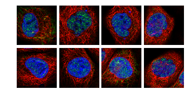

# Cell-segmentation 

A python script that automatically segments individual \[biological\] cells from a multi-cell image.  

# Usage and limitation

This algorithm was used in the Kaggle competition Human Protein Atlas Image Classification on full resolution images, however this script is slightly simplified. The example images ('Test-images') are lower-resolution images, but illustrate how the images were cropped before being fed to a neural network. The limitation of this implementation is that it probably won't work for any type of biological cell images --- beacuse it was specifically used for the Kaggle competition.
 
 
*Example of cropped images*:
 

